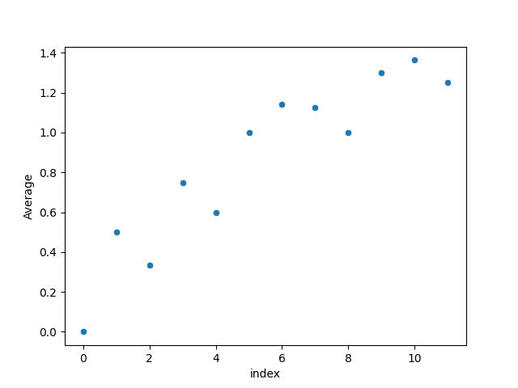
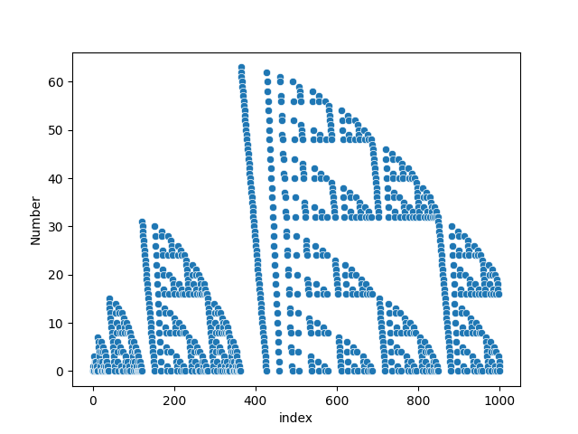

# flattened-sierpinski
The scripts `flattened-sierpinski_1.py` and `flattened-sierpinski_2.py` generate fractal sequences that I discovered while trying to implement [Sigrist's sequence](https://www.youtube.com/watch?v=j0o-pMIR8uk) in Python. I call it the flattened Sierpinski sequence because it looks lke a bunch of flattened Sierpinski triangles. 

output 1: `[0, 1, 0, 2, 0, 3, 2, 1, 0, 4, 2, 0, 5, 4, 1, 0, 6, 5, 4, 0, 7, 6, 5, 4, 3, 2, 1, 0, 8, 6, 4, 2, 0, 9, 8, 5, 4, 1, 0, 10, 9, 8, 4, 0, 11, 10, 9, 8, 3, 2, 1, 0]`

output 2: `[0, 1, 0, 0, 3, 2, 1, 0, 2, 0, 1, 0, 0, 7, 6, 5, 4, 3, 2, 1, 0, 6, 4, 2, 0, 5, 4, 1, 0, 4, 0, 3, 2, 1, 0, 2, 0, 1, 0, 0, 15, 14, 13, 12, 11, 10, 9, 8, 7, 6, 5, 4, 3, 2, 1, 0]`

# Plotting `flattened-sierpinski-1` with Seaborn
## Basic Scatterplots
Scatterplot of 10 numbers: \
 \
Scatterplot of 100 numbers: \
 \
Scatterplot of 1000 numbers: \

Scatterplot of 10000 numbers: \
 \
Scatterplot of 100,000 numbers: \

## Plotting the Average as $n \to \infty$
Scatterplot of the first 10 averages: \
 \
Scatterplot of the first 100 averages: \
 \ 
Scatterplot of the first 1,000 averages: \
 \
Scatterplot of the first 10,000 averages: \
 \
Scatterplot of the first 100,000 averages: \

# Plotting `flattened-sierpinski-2` with Seaborn
## Basic Scatterplots
Scatterplot of 10 numbers: \
 \
Scatterplot of 100 numbers: \
 \
Scatterplot of 1000 numbers: \
 \ 
Scatterplot of 10000 numbers: \
 \
Scatterplot of 100,000 numbers: \

## Plotting the Average as $n \to \infty$
Scatterplot of the first 10 averages: \
 \
Scatterplot of the first 100 averages: \
 \
Scatterplot of the first 1,000 averages: \
 \
Scatterplot of the first 10,000 averages: \
 \
Scatterplot of the first 100,000 averages: \
