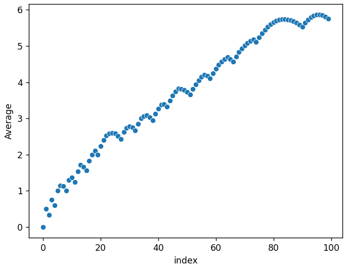

# flattened-sierpinski
The script `flattened-sierpinski.py` generates a fractal sequence that I discovered while trying to implement [Sigrist's sequence](https://www.youtube.com/watch?v=j0o-pMIR8uk) in Python. I call it the flattened Sierpinski sequence because it looks lke a bunch of flattened Sierpinski triangles. 

# Plotting with Seaborn
## Basic Scatterplots
Scatterplot of 10 numbers:

Scatterplot of 100 numbers:

Scatterplot of 1000 numbers:

Scatterplot of 10000 numbers:

Scatterplot of 100,000 numbers:

## Plotting the Average as $n \to \infty$
Scatterplot of the first 10 averages:

Scatterplot of the first 100 averages:

Scatterplot of the first 1,000 averages:

Scatterplot of the first 10,000 averages:

Scatterplot of the first 100,000 averages:
